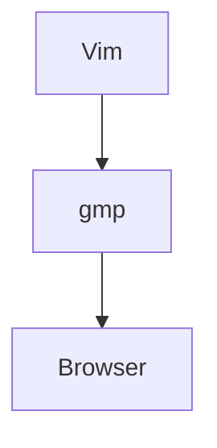

# gmp.vim demo

Edit this file. The page updates as you type and follows the cursor.


```python
print("highlighted")
```

- [x] task list
- [ ] open item

$$E = mc^2$$


```mermaid
graph TD
  A[Vim] --> B[gmp]
  B --> C[Browser]
```
